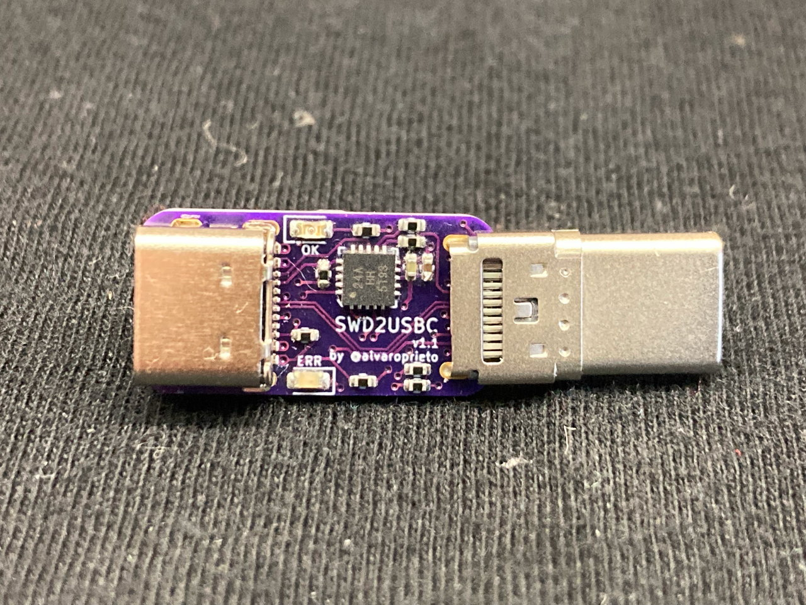
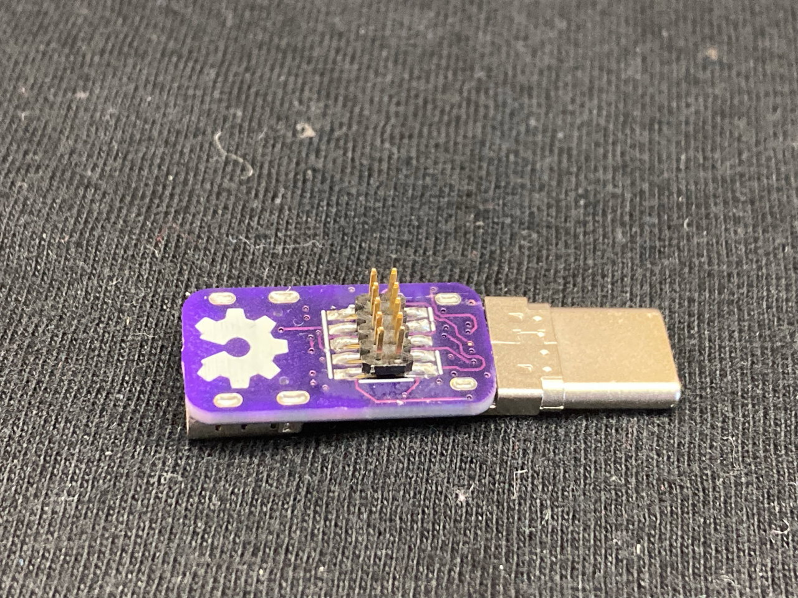
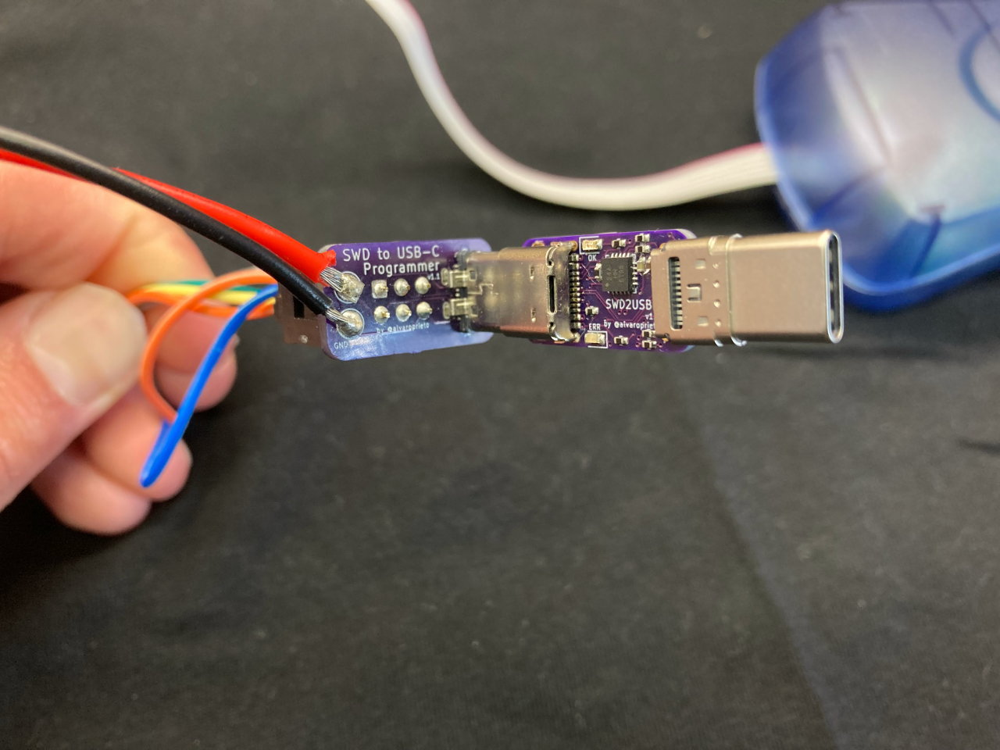
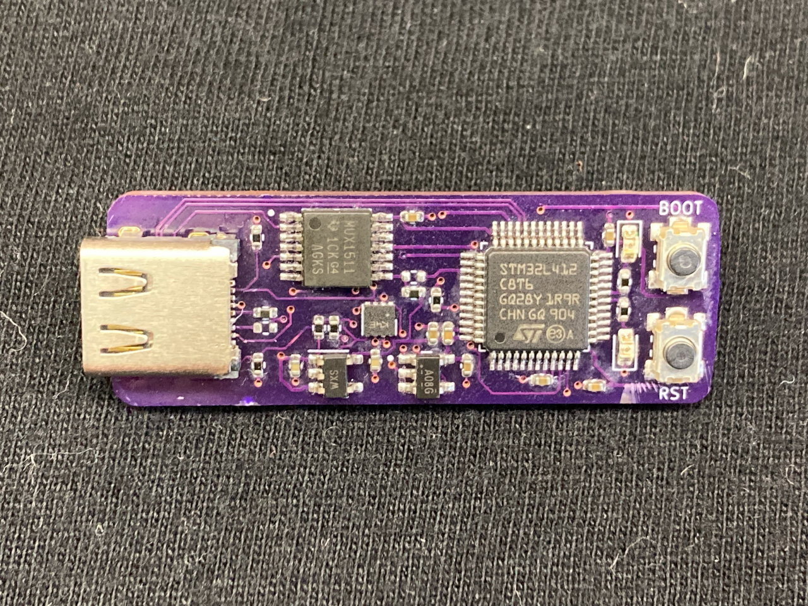
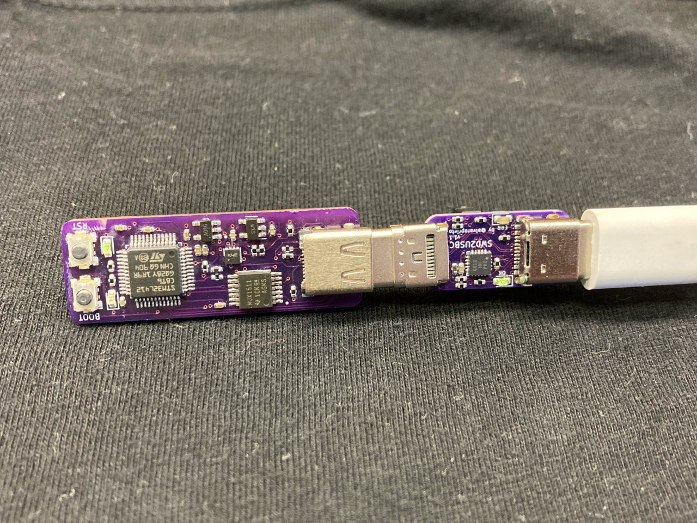
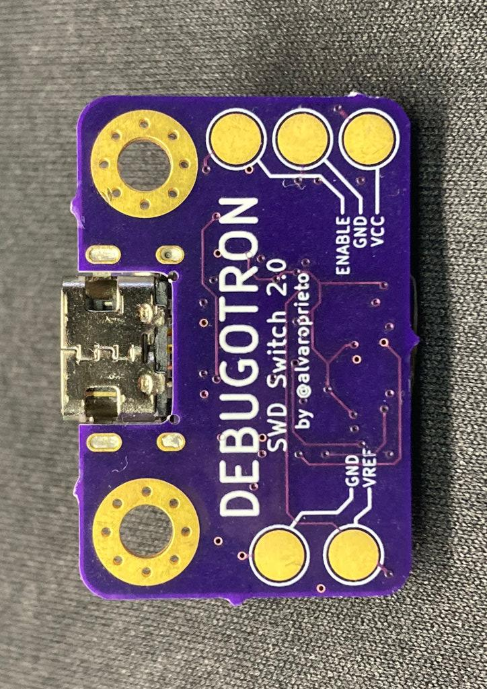
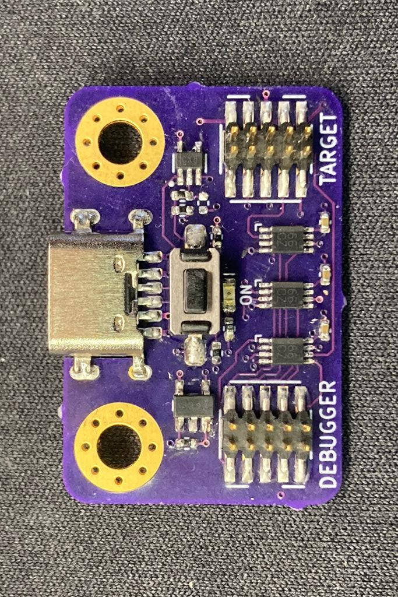
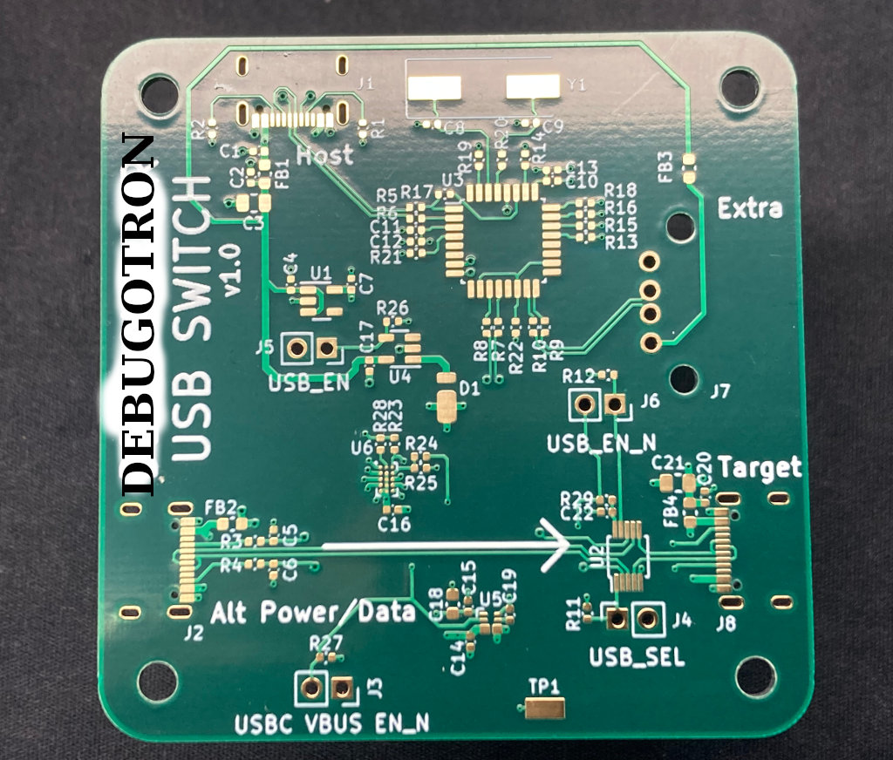

# Debugotron!

Debugotron is a collection of debugging/automation tools I've wanted in the past but didn't have access to. Currently, the tools include:

## SWD to USB-C!

 

Have you ever wanted to debug your device over USB-C? Sometimes there's not enough room for a JTAG/SWD connector, or even TAGConnect pads! The USB-C specification has a Debug Accessory Mode feature that allows for this. I have a [Twitter thread](https://twitter.com/alvaroprieto/status/1495860045728395278) with additional details. [Here's an unrolled version for easier reading.](https://threadreaderapp.com/thread/1495860045728395278.html)

### SWD to USB-C Programmer
Since the current adapter uses an ATTiny24a, I made a different programmer adapter for it

### Example Target
This is a simple STM32L4 board that implements USB-C DAM (the "proper way") as an example.

## SWD Switch
Tool that allows connecting/disconnecting the SWD/JTAG lines (Via ARM 10-pin connector) with a pushbutton (or external signal). This can be useful when trying to measure ultra low power consumption on a device while the debugger is connected (but not necessarily running/attached).

 

## USB-C Switch
This one is more of an automation tool. I've always wanted to automate firmware testing. Sometimes, having USB connected is necessary to program/communicate with a device, but at the same time, having USB connected changes the power characteristics of the test (or just operating mode).

For example, you might want to automatically test the power consumption of a battery powered device every night with the latest firmware. In order to run the test, you might have to connect to the device, flash it, then disconnect USB. The USB-C switch will allow software-controlled power and data connect/disconnects to a USB-C device. Depending on the configuration, it will also allow full 20V@5A pass-through by allowing USB-PD communication over the CC lines.

In the cases where you want to communicate with a device over USB while still powering it via 20V (or anything higher than 5V), a USB switch allows for a different USB cable to be used for data only, while power is taken from a separate USB-C port.

